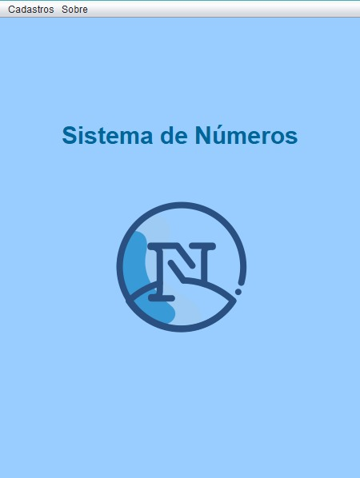
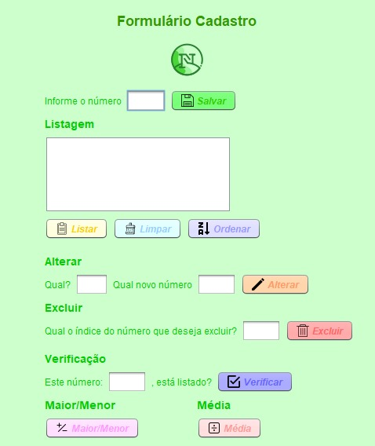
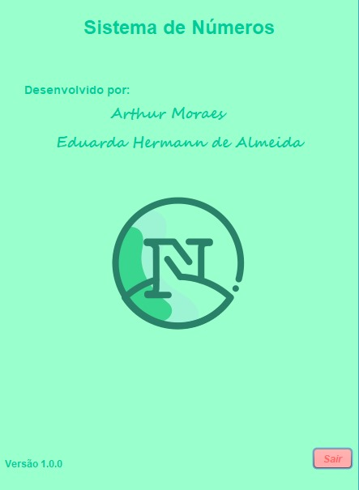

### Descrição:
O repositório ProjetoNumero armazena o Sistema de Números, nosso projeto, o tal tem como objetivo a manipulação de números à partir de um formulário. Este projeto foi proposto no Curso Técnico de Informática do Colégio ULBRA São Lucas.

## Ficha Ténica:

Desenvolvedores: @Xenoxys1 e @eduardahermannalmeida 

Linguagem:

Softwares:

Ícones:

https://www.iconfinder.com

Header/Footer:

https://leviarista.github.io/github-profile-header-generator/

## Preview:

### Menu
Este é o Menu Principal do Sistema, por onde pode acessar o Formulário de Cadastro e as Informações sobre o Sistema.

### Formulário de Cadastro
No Formulário de Cadastro é onde serão feitas as manipulações com os números.

### Sobre
Aqui é mostrado os nomes dos desenvolvedores.

